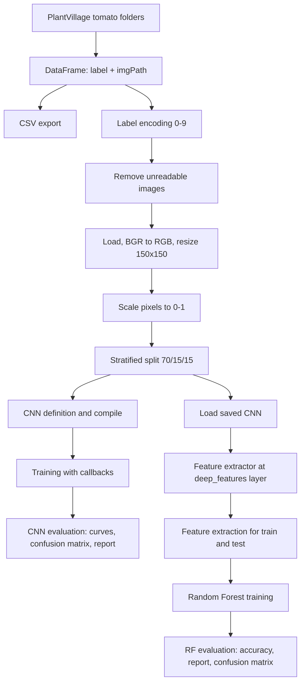

# Tomato Leaf Disease Classification (CNN and CNN Features + Random Forest)

## Overview

This repository contains a single Jupyter notebook, `tomato-diseases-classification.ipynb`, that implements an image-classification pipeline for tomato leaf diseases using the tomato subset of the PlantVillage dataset.

The notebook implements two complementary classification paths over the same preprocessed image data:

1. A convolutional neural network (CNN) built with TensorFlow/Keras that is trained end-to-end and produces class probabilities through a Softmax output layer.
2. A hybrid approach in which a previously saved CNN is loaded, truncated at a named intermediate dense layer (`deep_features`), and used as a fixed feature extractor whose activations are then classified with a scikit-learn `RandomForestClassifier`.

Both paths are evaluated on the same held-out test split with accuracy, a per-class classification report, and a confusion matrix.

## Problem Statement

Tomato leaves affected by different diseases show visually similar symptoms (spots, lesions, discoloration, mold), which makes manual visual inspection error-prone. The notebook addresses this as a supervised multi-class image-classification problem: given a fixed-size RGB leaf image, assign it to one of ten tomato leaf conditions (nine disease classes and one healthy class).

## Objectives

- Build a labeled image index (file path and class) from a directory-per-class dataset layout.
- Inspect representative samples of a class visually.
- Encode class names as integer labels and discard unreadable image files.
- Load, color-convert, resize, and normalize all images into an in-memory array.
- Split the data into stratified training, validation, and test sets.
- Define a configurable CNN architecture, compile it, and configure training with learning-rate scheduling, early stopping, and checkpointing.
- Evaluate the CNN with accuracy/loss curves, a confusion matrix, and a classification report.
- Reuse a saved CNN as a deep-feature extractor and train a Random Forest classifier on the extracted features.
- Measure Random Forest training and prediction time, evaluate it, and export its classification report to Excel.

## Project Type

- Deep Learning
- Computer Vision
- Image Classification
- Multi-class Classification
- Machine Learning (classical, via Random Forest)
- Feature Extraction / hybrid CNN + classical classifier
- Research / experimental notebook

## Workflow

```text
PlantVillage tomato class folders
        |
Build DataFrame (label, imgPath)  -->  export CSV index
        |
Sample visualization
        |
Label encoding (class name -> integer 0..9)
        |
Remove unreadable images
        |
Load images -> BGR to RGB -> resize 150x150 -> stack -> scale to [0, 1]
        |
Stratified split: train 70% / validation 15% / test 15%
        |
        +--> Path A: CNN (Softmax)
        |      build -> compile -> fit (max 50 epochs)
        |      callbacks: LR plateau, early stopping, checkpoint
        |      predict -> curves -> confusion matrix -> report
        |
        +--> Path B: hybrid
               load saved CNN -> truncate at "deep_features"
               extract features (train / test)
               Random Forest -> predict -> accuracy -> report -> confusion matrix
```



## Dataset

The notebook expects a directory-per-class image dataset located at:

```text
/kaggle/input/plantdisease/PlantVillage
```

Only the following ten class folders are used, in this exact order (the order defines the integer label mapping):

| Integer label | Class folder |
|---|---|
| 0 | `Tomato_Bacterial_spot` |
| 1 | `Tomato_Early_blight` |
| 2 | `Tomato_Late_blight` |
| 3 | `Tomato_Leaf_Mold` |
| 4 | `Tomato_Septoria_leaf_spot` |
| 5 | `Tomato_Spider_mites_Two_spotted_spider_mite` |
| 6 | `Tomato__Target_Spot` |
| 7 | `Tomato__Tomato_YellowLeaf__Curl_Virus` |
| 8 | `Tomato__Tomato_mosaic_virus` |
| 9 | `Tomato_healthy` |

Dataset handling visible in the source:
- 
- Within each class folder, file names are sorted so that the image order is deterministic.
- The resulting index (`label`, `imgPath`) is written to `/kaggle/working/tomato_images_df.csv`.

## Data Preprocessing

The preprocessing stages, in pipeline order:

1. **Index construction** — `os.listdir` over each selected class folder produces parallel lists of paths and class names, assembled into a `pandas.DataFrame`.
2. **Label encoding** — `encode_labels` builds a `{class name: index}` dictionary from the order of `selectedClasses` and replaces the `label` column with the corresponding integers. This yields integer targets compatible with the `sparse_categorical_crossentropy` loss used later.
3. **Invalid-file removal** — `remove_invalid_data` attempts `cv2.imread` on every path and drops rows whose image cannot be decoded, then resets the index. This protects the later bulk-loading step from `None` images.
4. **Image loading and geometric normalization** — `loadAndPreprocessImages` reads each image with OpenCV, converts it from OpenCV's BGR channel order to RGB (required for correct display with Matplotlib and for consistency with standard RGB pipelines), and resizes it to `150 x 150` pixels so that all samples share the fixed input shape the CNN expects.
5. **Array conversion** — images and labels are converted to NumPy arrays for splitting and training.
6. **Intensity scaling** — pixel values are divided by `255.0`, mapping the `[0, 255]` integer range to `[0, 1]`. Bounded inputs keep gradient magnitudes in a stable range during optimization.

No data augmentation (flips, rotations, color jitter) is implemented.

## Feature Engineering

Feature engineering is limited to the hybrid path, where the features are learned rather than hand-crafted:

- A saved Keras model is loaded and wrapped in a new `tf.keras.Model` whose output is the activation of the layer named `deep_features`.
- `feature_extractor.predict(...)` is called on the training and test image arrays with `batch_size=64`, producing dense feature vectors that replace raw pixels as the input representation for the Random Forest.
- In the CNN architecture defined in this notebook, `deep_features` is a `Dense` layer with 128 units, so the extracted representation is 128-dimensional for that architecture.

No classical descriptors (color histograms, texture features, PCA) are implemented.

## Data Splitting

| Step | Function | Parameters | Result |
|---|---|---|---|
| 1 | `train_test_split` | `test_size=0.3`, `random_state=42`, `shuffle=True`, `stratify=labels` | 70% train, 30% temporary |
| 2 | `train_test_split` | `test_size=0.5`, `random_state=42`, `shuffle=True`, `stratify=y_temp` | 15% validation, 15% test |

Stratification preserves the class proportions of the full dataset in every split.

## Models / Algorithms

### 1. CNN classifier (TensorFlow/Keras)

A `Sequential` model created by the `buildCNNModel` factory function. It is built, compiled, trained, and evaluated inside the notebook, and produces Softmax class probabilities.

### 2. Loaded CNN used as a feature extractor

A pre-existing Keras model is loaded from:

```text
/kaggle/input/models/alitafreshi/final-cnn-model/keras/default/1/95_cnn_model.keras
```

### 3. Random Forest classifier (scikit-learn)

`RandomForestClassifier` trained on the extracted deep features. It is an ensemble of decision trees whose predictions are aggregated by voting; it operates on the fixed-length feature vectors, not on raw images.

## Model Architecture

`buildCNNModel` constructs the network dynamically by iterating over the `convFilters` list. With the default arguments used in the notebook (`convFilters=[32, 32, 32]`, `dropoutRates=[0.1, 0.1, 0.1]`, `denseUnits=128`), the resulting layer sequence is:

| # | Layer | Configuration | Purpose |
|---|---|---|---|
| 1 | `Input` | shape `(150, 150, 3)` | Fixed-size RGB input tensor |
| 2 | `Conv2D` | 32 filters, 3x3 kernel, `padding="same"`, ReLU | Applies 32 learnable convolutional filters to extract local spatial patterns |
| 3 | `BatchNormalization` | — | Normalizes intermediate activations, which can stabilize optimization |
| 4 | `MaxPooling2D` | pool 2x2, strides 2x2 | Spatial downsampling that retains dominant local responses |
| 5 | `Dropout` | rate 0.1 | Regularization by randomly disabling a fraction of activations during training |
| 6-9 | `Conv2D` / `BatchNormalization` / `MaxPooling2D` / `Dropout` | 32 filters, 3x3, ReLU, `same`; pool 2x2; rate 0.1 | Second convolutional block over downsampled feature maps |
| 10-13 | `Conv2D` / `BatchNormalization` / `MaxPooling2D` / `Dropout` | 32 filters, 3x3, ReLU, `same`; pool 2x2; rate 0.1 | Third convolutional block |
| 14 | `GlobalAveragePooling2D` | name `feature_vector` | Averages each feature map into a single value, producing a compact vector without a `Flatten` layer |
| 15 | `Dense` | 128 units, ReLU, name `deep_features` | High-level representation; this is the layer tapped by the feature extractor |
| 16 | `Dense` | `numClasses` units, Softmax | Multi-class probability output |

`numClasses` is computed as `len(np.unique(labels))`, which is 10 when all ten class folders are present.

Configurable parameters exposed by `buildCNNModel`, with their defaults: `inputShape=(150, 150, 3)`, `convFilters=[32, 32, 32]`, `kernelSize=(3, 3)`, `poolSize=(2, 2)`, `strides=(2, 2)`, `activation="relu"`, `padding="same"`, `dropoutRates=[0.1, 0.1, 0.1]`, `denseUnits=128`.

## Hyperparameters

### CNN training

| Parameter | Value |
|---|---|
| Optimizer | `adam` (passed as a string to `model.compile`) |
| Loss | `sparse_categorical_crossentropy` |
| Metrics | `accuracy` |
| Epochs (maximum) | 50 |
| Batch size | 50 |
| Validation data | `(X_val, y_val)` |
| Input size | 150 x 150 x 3 |
| Random seed | 42 |

### Callbacks

| Callback | Configuration |
|---|---|
| `ReduceLROnPlateau` | `monitor="val_loss"`, `factor=0.5`, `patience=3`, `min_lr=1e-6`, `verbose=1` |
| `EarlyStopping` | `monitor="val_loss"`, `patience=5`, `restore_best_weights=True`, `verbose=1` |
| `ModelCheckpoint` | `filepath="/kaggle/working/best_cnn_model.keras"`, `monitor="val_loss"`, `save_best_only=True`, `verbose=1` |

Because `EarlyStopping` is configured, 50 is the maximum number of epochs; training may stop earlier.

### Random Forest

| Parameter | Value |
|---|---|
| `n_estimators` | 300 |
| `max_depth` | `None` |
| `min_samples_split` | 2 |
| `class_weight` | `"balanced_subsample"` |
| `random_state` | 42 |
| `n_jobs` | -1 |

`class_weight="balanced_subsample"` reweights classes inversely to their frequency within each tree's bootstrap sample, which is relevant when class counts are unequal.

### Feature extraction

| Parameter | Value |
|---|---|
| `batch_size` | 64 |
| `verbose` | 1 |

## Training Procedure

**CNN.** The model is configured to train on `X_train`/`y_train` for up to 50 epochs with a batch size of 50, validating on `(X_val, y_val)` after each epoch. The three callbacks halve the learning rate after three epochs without validation-loss improvement, stop training after five such epochs and restore the best weights, and write the best checkpoint to `best_cnn_model.keras` in the Kaggle working directory. The returned `history` object feeds the training-curve plots.

**Random Forest.** The classifier is fit on the extracted training features and their integer labels. Wall-clock training and prediction durations are measured with `time.perf_counter()` and printed. The Random Forest performs no gradient-based training and consumes the frozen CNN features directly.

## Evaluation

### CNN

- `model.predict(X_test)` produces class-probability vectors; `np.argmax` converts them to predicted class indices.
- The checkpointed model is reloaded with `tf.keras.models.load_model("best_cnn_model.keras")` and evaluated with `best_model.evaluate(X_test, y_test)`, printing test loss and test accuracy.
- `confusion_matrix` is computed over `labels=np.arange(10)` and row-normalized to percentages, so each cell shows the share of a true class assigned to a predicted class.
- `classification_report` prints per-class precision, recall, F1-score, and support.

### Random Forest

- `accuracy_score(y_test, rf_predictions)` is printed with four decimals.
- `classification_report(..., target_names=selectedClasses, output_dict=True, zero_division=0)` produces a dictionary report that is printed and exported to `rf_classification_report.xlsx` via `save_classification_report`.
- `confusion_matrix` over `labels=np.arange(10)` is computed and row-normalized to percentages for the heatmap.

### Metric meanings in this project

- **Accuracy** — the share of leaf images assigned to the correct class.
- **Precision** — among images predicted as a given condition, the share that truly belong to it.
- **Recall** — among images that truly belong to a given condition, the share the model identifies.
- **F1-score** — the harmonic mean of precision and recall, useful when class support is uneven.
- **Confusion matrix** — the class-level breakdown of correct and incorrect assignments, which exposes confusions between visually similar diseases.

## Results

The notebook implements the following result-producing logic:

- Printed test loss and test accuracy for the reloaded CNN checkpoint.
- A printed per-class classification report for the CNN predictions.
- A percentage-normalized CNN confusion matrix heatmap titled "CNN-Softmax Confusion Matrix".
- Printed Random Forest training and prediction times in seconds.
- Printed Random Forest test accuracy.
- A per-class Random Forest classification report, printed and exported to `rf_classification_report.xlsx`.
- A percentage-normalized Random Forest confusion matrix heatmap titled "CNN Features + Random Forest Confusion Matrix".
- 
## Visualizations

| Visualization | Implementation | Designed to show |
|---|---|---|
| Class sample grid | `show_samples(class_name)` — 1x3 Matplotlib grid with rounded-corner clipping via `FancyBboxPatch` | Randomly drawn example images for one selected class |
| Labeled random grid | `plot_with_labels(images, labels)` — 3x4 grid | Preprocessed images with their integer labels as titles |
| Accuracy curve | `plot_history(..., "accuracy", "val_accuracy")` | Training and validation accuracy across epochs |
| Loss curve | `plot_history(..., "loss", "val_loss")` | Training and validation loss across epochs |
| CNN confusion matrix | Seaborn heatmap, `cmap='summer'`, annotated, `vmin=0`, `vmax=100` | Row-normalized CNN confusions in percent |
| Random Forest confusion matrix | Seaborn heatmap, `cmap="Blues"`, annotated | Row-normalized Random Forest confusions in percent |

The plotting style is set globally with `plt.style.use('ggplot')`.

## Functions

### `save_figure(fig, class_name, filename=None, base_dir="/kaggle/working")`
Saves a Matplotlib figure to `base_dir` at 150 DPI with a tight bounding box. When `filename` is omitted, it is derived from `class_name` (spaces replaced by underscores, suffix `_samples.png`). Returns the output path.

### `show_samples(class_name, save=False, filename=None)`
Validates that `class_name` is in `selectedClasses` and present in `df`, randomly samples up to three rows for that class, reads each image with OpenCV, converts BGR to RGB, and renders them in a 1x3 grid with rounded-corner clipping. Optionally delegates to `save_figure`.

### `encode_labels(df, selected_classes, column_name="label")`
Builds a class-name-to-index mapping from the order of `selected_classes` and maps the label column to integers. Returns the modified DataFrame.

### `remove_invalid_data(df)`
Iterates over `imgPath` with a `tqdm` progress bar, attempts to decode each image, collects the positions of unreadable files, drops them, resets the index, and prints how many rows were removed and how many remain.

### `loadAndPreprocessImages(imagePaths, imageSize=(150, 150))`
Reads each image, converts BGR to RGB, resizes to `imageSize`, and returns the list of arrays.

### `plot_with_labels(images, labels, rows=3, cols=4, figsize=(25, 10))`
Displays `rows x cols` randomly chosen images with their labels as subplot titles.

### `buildCNNModel(...)`
Constructs the Sequential CNN described in the architecture section; the number of convolutional blocks follows the length of `convFilters`.

### `plot_history(history, title, ylabel, train_param, validation_param, xlabel="epoch")`
Plots one training metric and its validation counterpart from a Keras `History` object on shared axes.

### `save_classification_report(report, file_name="classification_report.xlsx")`
Converts a `classification_report` dictionary (`output_dict=True`) to a transposed DataFrame with the index named `Class` and writes it to an Excel file.

## Classes

No custom Python classes are defined in the notebook.

## Project Structure

### Observed structure

```text
Tomato Leaf Diseases Classification/
├── tomato-diseases-classification.ipynb
└── Tomato Leaf Diseases Classification.iml
```

### Paths referenced by the notebook (external, Kaggle-style)

```text
/kaggle/input/plantdisease/PlantVillage/<class folders>/          # dataset (read)
/kaggle/input/models/.../95_cnn_model.keras                       # saved CNN (read)
/kaggle/working/tomato_images_df.csv                              # image index (write)
/kaggle/working/best_cnn_model.keras                              # checkpoint (write)
best_cnn_model.keras                                              # checkpoint (read, relative)
rf_classification_report.xlsx                                     # RF report (write, relative)
/kaggle/working/<class>_samples.png                               # optional figure (write)
```

## Requirements

Third-party packages imported by the notebook:

| Package (import) | Install name |
|---|---|
| `numpy` | `numpy` |
| `pandas` | `pandas` |
| `matplotlib` | `matplotlib` |
| `seaborn` | `seaborn` |
| `cv2` | `opencv-python` |
| `tensorflow` / `keras` | `tensorflow` |
| `sklearn` | `scikit-learn` |
| `tqdm` | `tqdm` |
| `joblib` | `joblib` |
| — | `jupyter` |

Optional: `openpyxl` is required by `pandas.DataFrame.to_excel` to write `rf_classification_report.xlsx`.

Standard-library modules used: `os`, `random`, `time`, `warnings`.

## Installation

```bash
python -m venv .venv
```

Windows:

```bash
.venv\Scripts\activate
```

Linux/macOS:

```bash
source .venv/bin/activate
```

```bash
pip install -r requirements.txt
```

```bash
jupyter lab
```

## Dataset Setup

1. Obtain the PlantVillage dataset and place the ten tomato class folders listed above under a single parent directory.
2. Either reproduce the Kaggle layout (`/kaggle/input/plantdisease/PlantVillage`) or edit `dataDir` in the configuration cell to point at your local directory.
3. For the Random Forest section, obtain the saved Keras model referenced as `95_cnn_model.keras` and update its path in the model-loading cell; the file is not included in this repository.
4. Update the `/kaggle/working/...` output paths if you are not running on Kaggle, since that directory does not exist in a local environment.

## Usage

1. Clone or download the project.
2. Create and activate a virtual environment and install the dependencies.
3. Place the dataset and adjust `dataDir` and the output paths.
4. Launch Jupyter and open `tomato-diseases-classification.ipynb`.
5. Run the cells sequentially from top to bottom. Cells depend on variables created earlier (`df`, `images`, `labels`, `X_train`, `model`, `history`, `feature_extractor`), so out-of-order execution will fail or operate on stale state.
6. To run only the CNN section, execute through the classification-report cell; the Random Forest section additionally requires the external saved model.

## Reproducibility

- A single `SEED = 42` is set and applied via `os.environ["PYTHONHASHSEED"]`, `random.seed`, `np.random.seed`, and `tf.keras.utils.set_random_seed`.
- The same seed is used as `random_state` for both `train_test_split` calls and for the `RandomForestClassifier`.
- Class folder order and, within each folder, file-name order are both fixed, so the image index is deterministic.
- The seeding cell appears after the sample-visualization cells, so the images shown by `show_samples` and `plot_with_labels` are not seed-controlled.
- Setting `PYTHONHASHSEED` from inside a running interpreter does not affect that interpreter's hash randomization; it must be set before the process starts.
- GPU kernel non-determinism is not disabled, so bit-identical reproduction of training runs on GPU is not guaranteed.
- The Random Forest path depends on an external model file that is not part of the repository, so that section cannot be reproduced without it.

## Technical Notes

- Images are read with OpenCV in BGR order and explicitly converted to RGB in both the visualization and the loading functions.
- The entire dataset is materialized in memory as one NumPy array; after division by `255.0` it becomes `float64`, which requires roughly eight bytes per channel value.
- `sparse_categorical_crossentropy` is used with integer labels, so no one-hot encoding is needed.
- `GlobalAveragePooling2D` replaces a `Flatten` layer, which keeps the classifier head small regardless of the spatial size of the last feature map.
- The named layers `feature_vector` and `deep_features` exist so that a trained model can later be truncated for feature extraction, which is exactly what the Random Forest section does.
- Pixel scaling is a fixed, stateless operation, so applying it before the split does not transfer information between splits.
- `y_pred` for the CNN confusion matrix and classification report comes from the in-memory `model`, whereas the printed test loss and accuracy come from the separately reloaded checkpoint.
