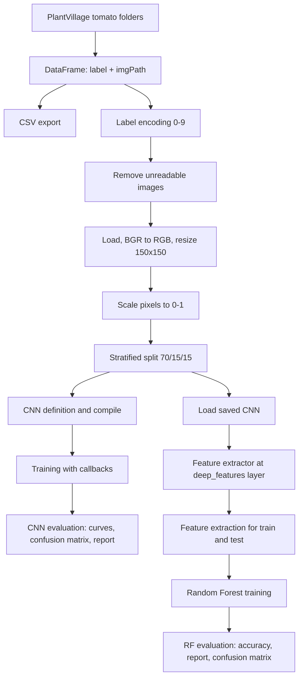

# طبقه‌بندی بیماری‌های برگ گوجه‌فرنگی (CNN و ترکیب ویژگی‌های CNN با Random Forest)

## معرفی پروژه

این مخزن شامل یک نوت‌بوک Jupyter با نام `tomato-diseases-classification.ipynb` است که یک خط لوله (pipeline) کامل برای طبقه‌بندی تصاویر برگ گوجه‌فرنگی بر پایهٔ زیرمجموعهٔ گوجه‌فرنگی از دیتاست PlantVillage پیاده‌سازی می‌کند.

در این نوت‌بوک دو مسیر طبقه‌بندی مکمل روی داده‌های تصویری یکسان پیاده‌سازی شده است:

۱. یک شبکهٔ عصبی کانولوشنی (CNN) مبتنی بر TensorFlow/Keras که به‌صورت end-to-end آموزش داده می‌شود و خروجی آن احتمال کلاس‌ها از طریق لایهٔ Softmax است.

۲. یک رویکرد ترکیبی که در آن یک مدل CNN ذخیره‌شده بارگذاری می‌شود، در لایهٔ میانی با نام `deep_features` برش می‌خورد و به‌عنوان یک Feature Extractor ثابت به کار می‌رود؛ سپس بردارهای ویژگی استخراج‌شده با `RandomForestClassifier` از scikit-learn طبقه‌بندی می‌شوند.

هر دو مسیر روی همان مجموعهٔ آزمون (test split) با معیار Accuracy، گزارش کلاس‌به‌کلاس (classification report) و ماتریس درهم‌ریختگی (confusion matrix) ارزیابی می‌شوند.

## بیان مسئله

برگ‌های گوجه‌فرنگی مبتلا به بیماری‌های مختلف، نشانه‌های بصری مشابهی دارند (لکه، زخم، تغییر رنگ، کپک) و به همین دلیل تشخیص چشمی دستی مستعد خطاست. نوت‌بوک این موضوع را به‌صورت یک مسئلهٔ طبقه‌بندی تصویری چندکلاسه با ناظر فرموله می‌کند: با دریافت یک تصویر RGB با ابعاد ثابت، آن تصویر باید به یکی از ده وضعیت برگ گوجه‌فرنگی (نُه کلاس بیماری و یک کلاس سالم) نسبت داده شود.

## اهداف پروژه

اهداف زیر از روی کد پیاده‌سازی‌شده و سرفصل‌های Markdown نوت‌بوک استخراج شده‌اند:

- ساخت یک فهرست برچسب‌دار از تصاویر (مسیر فایل و کلاس) بر اساس ساختار «هر کلاس در یک پوشه».
- مشاهدهٔ بصری چند نمونهٔ تصادفی از یک کلاس.
- کدگذاری نام کلاس‌ها به برچسب عددی و حذف فایل‌های تصویری غیرقابل‌خواندن.
- بارگذاری، تبدیل فضای رنگ، تغییر اندازه و نرمال‌سازی تمام تصاویر در حافظه.
- تقسیم داده‌ها به مجموعه‌های آموزش، اعتبارسنجی و آزمون به‌صورت stratified.
- تعریف یک معماری CNN پیکربندی‌پذیر، کامپایل آن و تنظیم فرایند آموزش با زمان‌بندی نرخ یادگیری، توقف زودهنگام و ذخیرهٔ checkpoint.
- ارزیابی CNN با نمودارهای accuracy و loss، ماتریس درهم‌ریختگی و گزارش طبقه‌بندی.
- استفادهٔ مجدد از یک CNN ذخیره‌شده به‌عنوان استخراج‌کنندهٔ ویژگی عمیق و آموزش Random Forest روی ویژگی‌های استخراج‌شده.
- اندازه‌گیری زمان آموزش و پیش‌بینی Random Forest، ارزیابی آن و خروجی‌گرفتن گزارش طبقه‌بندی در قالب فایل Excel.

## نوع پروژه

- Deep Learning
- Computer Vision
- Image Classification
- طبقه‌بندی چندکلاسه (Multi-class Classification)
- یادگیری ماشین کلاسیک (از طریق Random Forest)
- Feature Extraction و رویکرد ترکیبی CNN + طبقه‌بند کلاسیک
- نوت‌بوک پژوهشی / آزمایشی

## روند کلی اجرا

```text
پوشه‌های کلاس‌های گوجه‌فرنگی در PlantVillage
        |
ساخت DataFrame (label, imgPath)  -->  ذخیرهٔ فهرست در CSV
        |
مصورسازی نمونه‌ها
        |
Label Encoding (نام کلاس -> عدد ۰ تا ۹)
        |
حذف تصاویر غیرقابل‌خواندن
        |
بارگذاری تصاویر -> تبدیل BGR به RGB -> تغییر اندازه به 150x150 -> مقیاس‌دهی به بازهٔ [0, 1]
        |
تقسیم stratified: آموزش ۷۰٪ / اعتبارسنجی ۱۵٪ / آزمون ۱۵٪
        |
        +--> مسیر A: CNN با خروجی Softmax
        |      ساخت -> کامپایل -> آموزش (حداکثر ۵۰ epoch)
        |      callbacks: کاهش نرخ یادگیری، EarlyStopping، ModelCheckpoint
        |      پیش‌بینی -> نمودارها -> confusion matrix -> گزارش
        |
        +--> مسیر B: رویکرد ترکیبی
               بارگذاری CNN ذخیره‌شده -> برش در لایهٔ "deep_features"
               استخراج ویژگی (آموزش / آزمون)
               Random Forest -> پیش‌بینی -> accuracy -> گزارش -> confusion matrix
```



## مجموعه‌داده

نوت‌بوک انتظار دارد مجموعه‌داده‌ای با ساختار «هر کلاس در یک پوشه» در مسیر زیر موجود باشد:

```text
/kaggle/input/plantdisease/PlantVillage
```

تنها ده پوشهٔ کلاس زیر و دقیقاً با همین ترتیب استفاده می‌شوند؛ این ترتیب، نگاشت برچسب‌های عددی را تعیین می‌کند:

| برچسب عددی | پوشهٔ کلاس |
|---|---|
| 0 | `Tomato_Bacterial_spot` |
| 1 | `Tomato_Early_blight` |
| 2 | `Tomato_Late_blight` |
| 3 | `Tomato_Leaf_Mold` |
| 4 | `Tomato_Septoria_leaf_spot` |
| 5 | `Tomato_Spider_mites_Two_spotted_spider_mite` |
| 6 | `Tomato__Target_Spot` |
| 7 | `Tomato__Tomato_YellowLeaf__Curl_Virus` |
| 8 | `Tomato__Tomato_mosaic_virus` |
| 9 | `Tomato_healthy` |

نکات قابل استخراج از کد دربارهٔ داده‌ها:

- اگر پوشهٔ یک کلاس روی دیسک موجود نباشد، از آن صرف‌نظر می‌شود و خطایی ایجاد نمی‌شود.
- نام فایل‌ها درون هر پوشه مرتب (sorted) می‌شوند تا ترتیب تصاویر قطعی و تکرارپذیر باشد.
- فهرست نهایی (`label`, `imgPath`) در مسیر `/kaggle/working/tomato_images_df.csv` ذخیره می‌شود.
- تعداد کل تصاویر، تعداد تصاویر هر کلاس و رزولوشن اصلی تصاویر در سورس نوت‌بوک مشخص نشده است.

## پیش‌پردازش داده‌ها

مراحل پیش‌پردازش به ترتیب اجرای خط لوله:

۱. **ساخت فهرست تصاویر** — با `os.listdir` روی هر پوشهٔ کلاس، دو لیست موازی از مسیرها و نام کلاس‌ها ساخته و در یک `pandas.DataFrame` قرار می‌گیرد.

۲. **Label Encoding** — تابع `encode_labels` یک دیکشنری `{نام کلاس: اندیس}` بر اساس ترتیب `selectedClasses` می‌سازد و ستون `label` را با مقادیر عددی متناظر جایگزین می‌کند. نتیجه، برچسب‌های عددی سازگار با تابع زیان `sparse_categorical_crossentropy` است که در ادامه استفاده می‌شود.

۳. **حذف دادهٔ نامعتبر** — تابع `remove_invalid_data` برای هر مسیر `cv2.imread` را اجرا می‌کند و ردیف‌هایی که تصویرشان قابل decode نیست حذف و ایندکس بازنشانی می‌شود. این کار از رسیدن مقدار `None` به مرحلهٔ بارگذاری انبوه جلوگیری می‌کند.

۴. **بارگذاری و نرمال‌سازی هندسی تصاویر** — تابع `loadAndPreprocessImages` هر تصویر را با OpenCV می‌خواند، ترتیب کانال‌ها را از BGR (پیش‌فرض OpenCV) به RGB تبدیل می‌کند (لازم برای نمایش صحیح با Matplotlib و هماهنگی با خطوط لولهٔ استاندارد RGB) و اندازهٔ آن را به `150 x 150` پیکسل تغییر می‌دهد تا همهٔ نمونه‌ها ابعاد ورودی ثابت مورد انتظار CNN را داشته باشند.

۵. **تبدیل به آرایه** — تصاویر و برچسب‌ها برای مرحلهٔ تقسیم و آموزش به آرایه‌های NumPy تبدیل می‌شوند.

۶. **مقیاس‌دهی شدت پیکسل‌ها** — مقادیر پیکسل بر `255.0` تقسیم می‌شوند و بازهٔ `[0, 255]` به `[0, 1]` نگاشت می‌شود. ورودی کران‌دار باعث می‌شود اندازهٔ گرادیان‌ها در فرایند بهینه‌سازی در محدودهٔ پایدارتری بماند.

هیچ Data Augmentation ای (چرخش، قرینه‌سازی، تغییر رنگ) پیاده‌سازی نشده است.

## مهندسی ویژگی

مهندسی ویژگی تنها در مسیر ترکیبی وجود دارد و ویژگی‌ها به‌جای دست‌ساز بودن، یادگرفته‌شده هستند:

- یک مدل Keras ذخیره‌شده بارگذاری و در قالب یک `tf.keras.Model` جدید بسته‌بندی می‌شود که خروجی آن، فعال‌سازی لایهٔ `deep_features` است.
- متد `feature_extractor.predict(...)` با `batch_size=64` روی آرایه‌های تصویر آموزش و آزمون فراخوانی می‌شود و بردارهای ویژگی متراکمی تولید می‌کند که جایگزین پیکسل خام به‌عنوان نمایش ورودیِ Random Forest می‌شوند.
- در معماری CNN تعریف‌شده در همین نوت‌بوک، لایهٔ `deep_features` یک لایهٔ `Dense` با ۱۲۸ نورون است؛ بنابراین برای آن معماری، بردار ویژگی ۱۲۸‌بُعدی خواهد بود.

## تقسیم داده‌ها

| مرحله | تابع | پارامترها | نتیجه |
|---|---|---|---|
| ۱ | `train_test_split` | `test_size=0.3`، `random_state=42`، `shuffle=True`، `stratify=labels` | ۷۰٪ آموزش، ۳۰٪ موقت |
| ۲ | `train_test_split` | `test_size=0.5`، `random_state=42`، `shuffle=True`، `stratify=y_temp` | ۱۵٪ اعتبارسنجی، ۱۵٪ آزمون |

استفاده از stratify باعث می‌شود نسبت کلاس‌ها در همهٔ بخش‌ها مشابه کل مجموعه‌داده باقی بماند.

## مدل‌ها و الگوریتم‌های استفاده‌شده

### ۱. طبقه‌بند CNN (TensorFlow/Keras)

یک مدل `Sequential` که توسط تابع سازندهٔ `buildCNNModel` ساخته می‌شود. این مدل درون نوت‌بوک ساخته، کامپایل، آموزش و ارزیابی می‌شود و خروجی آن احتمال کلاس‌ها با Softmax است.

### ۲. مدل CNN بارگذاری‌شده در نقش Feature Extractor

یک مدل Keras از پیش ذخیره‌شده از مسیر زیر بارگذاری می‌شود:

```text
/kaggle/input/models/alitafreshi/final-cnn-model/keras/default/1/95_cnn_model.keras
```

این مدل در نوت‌بوک آموزش یا fine-tune نمی‌شود و تنها در لایهٔ `deep_features` برش می‌خورد و برای inference و تولید بردار ویژگی به کار می‌رود.

### ۳. طبقه‌بند Random Forest (scikit-learn)

`RandomForestClassifier` روی ویژگی‌های عمیق استخراج‌شده آموزش می‌بیند. این مدل یک ensemble از درخت‌های تصمیم است که پیش‌بینی‌های آن‌ها با رأی‌گیری تجمیع می‌شود و ورودی آن بردارهای ویژگی با طول ثابت است، نه تصویر خام.

## معماری مدل

تابع `buildCNNModel` شبکه را به‌صورت پویا و با پیمایش لیست `convFilters` می‌سازد. با مقادیر پیش‌فرضی که در نوت‌بوک استفاده شده‌اند (`convFilters=[32, 32, 32]`، `dropoutRates=[0.1, 0.1, 0.1]`، `denseUnits=128`) ترتیب لایه‌ها به شکل زیر است:

| # | لایه | پیکربندی | نقش |
|---|---|---|---|
| ۱ | `Input` | ابعاد `(150, 150, 3)` | تانسور ورودی RGB با ابعاد ثابت |
| ۲ | `Conv2D` | ۳۲ فیلتر، کرنل ۳×۳، `padding="same"`، ReLU | اعمال ۳۲ فیلتر کانولوشنی قابل یادگیری برای استخراج الگوهای محلی |
| ۳ | `BatchNormalization` | — | نرمال‌سازی فعال‌سازی‌های میانی که می‌تواند پایداری بهینه‌سازی را افزایش دهد |
| ۴ | `MaxPooling2D` | pool ۲×۲، strides ۲×۲ | کاهش ابعاد مکانی با حفظ پاسخ‌های محلی غالب |
| ۵ | `Dropout` | نرخ ۰٫۱ | منظم‌سازی از طریق غیرفعال‌کردن تصادفی بخشی از فعال‌سازی‌ها در زمان آموزش |
| ۶ تا ۹ | `Conv2D` / `BatchNormalization` / `MaxPooling2D` / `Dropout` | ۳۲ فیلتر، ۳×۳، ReLU، `same`؛ pool ۲×۲؛ نرخ ۰٫۱ | بلوک کانولوشنی دوم روی نقشه‌های ویژگی کوچک‌شده |
| ۱۰ تا ۱۳ | `Conv2D` / `BatchNormalization` / `MaxPooling2D` / `Dropout` | ۳۲ فیلتر، ۳×۳، ReLU، `same`؛ pool ۲×۲؛ نرخ ۰٫۱ | بلوک کانولوشنی سوم |
| ۱۴ | `GlobalAveragePooling2D` | با نام `feature_vector` | میانگین‌گیری از هر نقشهٔ ویژگی و تولید یک بردار فشرده بدون نیاز به `Flatten` |
| ۱۵ | `Dense` | ۱۲۸ نورون، ReLU، با نام `deep_features` | نمایش سطح‌بالا؛ همین لایه توسط Feature Extractor برداشته می‌شود |
| ۱۶ | `Dense` | به تعداد `numClasses`، Softmax | خروجی احتمال چندکلاسه |

مقدار `numClasses` از طریق `len(np.unique(labels))` محاسبه می‌شود که در صورت موجودبودن هر ده پوشهٔ کلاس برابر ۱۰ خواهد بود.

پارامترهای پیکربندی‌پذیر `buildCNNModel` به همراه مقادیر پیش‌فرض: `inputShape=(150, 150, 3)`، `convFilters=[32, 32, 32]`، `kernelSize=(3, 3)`، `poolSize=(2, 2)`، `strides=(2, 2)`، `activation="relu"`، `padding="same"`، `dropoutRates=[0.1, 0.1, 0.1]`، `denseUnits=128`.

## ابرپارامترها

### آموزش CNN

| پارامتر | مقدار |
|---|---|
| Optimizer | `adam` (به‌صورت رشته به `model.compile` داده شده) |
| Loss | `sparse_categorical_crossentropy` |
| Metrics | `accuracy` |
| حداکثر Epochs | ۵۰ |
| Batch size | ۵۰ |
| دادهٔ اعتبارسنجی | `(X_val, y_val)` |
| ابعاد ورودی | 150 × 150 × 3 |
| Random seed | ۴۲ |


### Callbacks

| Callback | پیکربندی |
|---|---|
| `ReduceLROnPlateau` | `monitor="val_loss"`، `factor=0.5`، `patience=3`، `min_lr=1e-6`، `verbose=1` |
| `EarlyStopping` | `monitor="val_loss"`، `patience=5`، `restore_best_weights=True`، `verbose=1` |
| `ModelCheckpoint` | `filepath="/kaggle/working/best_cnn_model.keras"`، `monitor="val_loss"`، `save_best_only=True`، `verbose=1` |

به‌دلیل وجود `EarlyStopping`، عدد ۵۰ حداکثر تعداد epoch است و آموزش می‌تواند زودتر متوقف شود.

### Random Forest

| پارامتر | مقدار |
|---|---|
| `n_estimators` | ۳۰۰ |
| `max_depth` | `None` |
| `min_samples_split` | ۲ |
| `class_weight` | `"balanced_subsample"` |
| `random_state` | ۴۲ |
| `n_jobs` | ‎-1 |

مقدار `class_weight="balanced_subsample"` وزن کلاس‌ها را در هر نمونهٔ bootstrap به‌صورت معکوس با فراوانی آن‌ها تنظیم می‌کند که در شرایط نامتوازن‌بودن تعداد نمونه‌های کلاس‌ها اهمیت دارد.

### استخراج ویژگی

| پارامتر | مقدار |
|---|---|
| `batch_size` | ۶۴ |
| `verbose` | ۱ |

## روند آموزش مدل

**CNN.** مدل طوری پیکربندی شده است که روی `X_train`/`y_train` تا حداکثر ۵۰ epoch با batch size برابر ۵۰ آموزش ببیند و پس از هر epoch روی `(X_val, y_val)` اعتبارسنجی شود. سه callback تعریف‌شده، نرخ یادگیری را پس از سه epoch بدون بهبود `val_loss` نصف می‌کنند، پس از پنج epoch بدون بهبود آموزش را متوقف کرده و بهترین وزن‌ها را بازمی‌گردانند، و بهترین checkpoint را در فایل `best_cnn_model.keras` در دایرکتوری working ذخیره می‌کنند. شیء `history` بازگشتی، ورودی نمودارهای روند آموزش است.

**Random Forest.** این طبقه‌بند روی ویژگی‌های استخراج‌شدهٔ آموزش و برچسب‌های عددی متناظر fit می‌شود. مدت زمان آموزش و پیش‌بینی با `time.perf_counter()` اندازه‌گیری و چاپ می‌شود. Random Forest هیچ آموزش مبتنی بر گرادیان انجام نمی‌دهد و مستقیماً از ویژگی‌های ثابت CNN استفاده می‌کند.

## ارزیابی مدل

### CNN

- `model.predict(X_test)` بردارهای احتمال کلاس را تولید می‌کند و `np.argmax` آن‌ها را به اندیس کلاس پیش‌بینی‌شده تبدیل می‌کند.
- مدل checkpoint با `tf.keras.models.load_model("best_cnn_model.keras")` دوباره بارگذاری و با `best_model.evaluate(X_test, y_test)` ارزیابی می‌شود و مقادیر test loss و test accuracy چاپ می‌شوند.
- `confusion_matrix` روی `labels=np.arange(10)` محاسبه و سطری به درصد نرمال‌سازی می‌شود؛ بنابراین هر خانه نشان‌دهندهٔ سهم یک کلاس واقعی است که به یک کلاس پیش‌بینی‌شده نسبت داده شده است.
- `classification_report` مقادیر precision، recall، F1-score و support را به تفکیک کلاس چاپ می‌کند.

### Random Forest

- `accuracy_score(y_test, rf_predictions)` با چهار رقم اعشار چاپ می‌شود.
- `classification_report(..., target_names=selectedClasses, output_dict=True, zero_division=0)` یک گزارش دیکشنری تولید می‌کند که چاپ شده و از طریق `save_classification_report` در فایل `rf_classification_report.xlsx` ذخیره می‌شود.
- `confusion_matrix` روی `labels=np.arange(10)` محاسبه و برای heatmap سطری به درصد نرمال‌سازی می‌شود.

### معنای معیارها در این پروژه

- **Accuracy** — نسبت تصاویری که به کلاس درست نسبت داده شده‌اند.
- **Precision** — از میان تصاویری که به یک کلاس نسبت داده شده‌اند، چه سهمی واقعاً متعلق به آن کلاس است.
- **Recall** — از میان تصاویری که واقعاً متعلق به یک کلاس هستند، چه سهمی توسط مدل تشخیص داده شده است.
- **F1-score** — میانگین همساز precision و recall که در شرایط نامتوازن‌بودن تعداد نمونه‌ها مفید است.
- **Confusion matrix** — تفکیک کلاس‌به‌کلاس پیش‌بینی‌های درست و نادرست که اشتباه‌گرفتن بیماری‌های از نظر ظاهری مشابه را آشکار می‌کند.

## نتایج

منطق تولید نتایج که در نوت‌بوک پیاده‌سازی شده است:

- چاپ test loss و test accuracy برای مدل checkpoint بارگذاری‌شدهٔ CNN.
- چاپ گزارش طبقه‌بندی کلاس‌به‌کلاس برای پیش‌بینی‌های CNN.
- نمودار heatmap ماتریس درهم‌ریختگی CNN به‌صورت درصدی با عنوان «CNN-Softmax Confusion Matrix».
- چاپ زمان آموزش و زمان پیش‌بینی Random Forest بر حسب ثانیه.
- چاپ accuracy مدل Random Forest روی مجموعهٔ آزمون.
- گزارش طبقه‌بندی کلاس‌به‌کلاس Random Forest که چاپ و در فایل `rf_classification_report.xlsx` ذخیره می‌شود.
- نمودار heatmap ماتریس درهم‌ریختگی Random Forest به‌صورت درصدی با عنوان «CNN Features + Random Forest Confusion Matrix».

## نمودارها و مصورسازی‌ها

| نمودار | پیاده‌سازی | هدف نمایش |
|---|---|---|
| شبکهٔ نمونه‌های یک کلاس | `show_samples(class_name)` — شبکهٔ ۱×۳ در Matplotlib با گوشه‌های گرد از طریق `FancyBboxPatch` | تصاویر نمونهٔ انتخاب‌شده به‌صورت تصادفی از یک کلاس |
| شبکهٔ تصادفی برچسب‌دار | `plot_with_labels(images, labels)` — شبکهٔ ۳×۴ | تصاویر پیش‌پردازش‌شده به همراه برچسب عددی در عنوان هر تصویر |
| نمودار Accuracy | `plot_history(..., "accuracy", "val_accuracy")` | روند accuracy آموزش و اعتبارسنجی در طول epochها |
| نمودار Loss | `plot_history(..., "loss", "val_loss")` | روند loss آموزش و اعتبارسنجی در طول epochها |
| Confusion matrix مدل CNN | heatmap در Seaborn، `cmap='summer'`، همراه با مقدار، `vmin=0`، `vmax=100` | درهم‌ریختگی نرمال‌شدهٔ سطری CNN بر حسب درصد |
| Confusion matrix مدل Random Forest | heatmap در Seaborn، `cmap="Blues"`، همراه با مقدار | درهم‌ریختگی نرمال‌شدهٔ سطری Random Forest بر حسب درصد |

سبک کلی نمودارها با `plt.style.use('ggplot')` تنظیم شده است.

## توابع مهم

### `save_figure(fig, class_name, filename=None, base_dir="/kaggle/working")`
یک figure از Matplotlib را با کیفیت ۱۵۰ DPI و حاشیهٔ فشرده در `base_dir` ذخیره می‌کند. اگر `filename` داده نشود، از روی `class_name` ساخته می‌شود (فاصله‌ها به زیرخط تبدیل و پسوند `_samples.png` اضافه می‌شود). مسیر خروجی را برمی‌گرداند.

### `show_samples(class_name, save=False, filename=None)`
بررسی می‌کند که `class_name` در `selectedClasses` و در `df` موجود باشد، حداکثر سه ردیف از آن کلاس را به‌صورت تصادفی انتخاب می‌کند، هر تصویر را با OpenCV می‌خواند، BGR را به RGB تبدیل می‌کند و آن‌ها را در شبکهٔ ۱×۳ با گوشه‌های گرد نمایش می‌دهد. در صورت نیاز ذخیره‌سازی را به `save_figure` واگذار می‌کند.

### `encode_labels(df, selected_classes, column_name="label")`
نگاشت «نام کلاس به اندیس» را بر اساس ترتیب `selected_classes` می‌سازد و ستون برچسب را به عدد تبدیل می‌کند. DataFrame تغییریافته را برمی‌گرداند.

### `remove_invalid_data(df)`
ستون `imgPath` را با نوار پیشرفت `tqdm` پیمایش می‌کند، decode هر تصویر را امتحان می‌کند، موقعیت فایل‌های غیرقابل‌خواندن را جمع‌آوری و حذف می‌کند، ایندکس را بازنشانی می‌کند و تعداد ردیف‌های حذف‌شده و باقی‌مانده را چاپ می‌کند.

### `loadAndPreprocessImages(imagePaths, imageSize=(150, 150))`
هر تصویر را می‌خواند، BGR را به RGB تبدیل می‌کند، اندازهٔ آن را به `imageSize` تغییر می‌دهد و لیست آرایه‌ها را برمی‌گرداند.

### `plot_with_labels(images, labels, rows=3, cols=4, figsize=(25, 10))`
تعداد `rows x cols` تصویر انتخاب‌شده به‌صورت تصادفی را به همراه برچسب آن‌ها در عنوان هر زیرنمودار نمایش می‌دهد.

### `buildCNNModel(...)`
شبکهٔ Sequential توصیف‌شده در بخش معماری را می‌سازد؛ تعداد بلوک‌های کانولوشنی برابر طول `convFilters` است.

### `plot_history(history, title, ylabel, train_param, validation_param, xlabel="epoch")`
یک معیار آموزش و معیار اعتبارسنجی متناظر آن را از شیء `History` کراس روی محورهای مشترک رسم می‌کند.

### `save_classification_report(report, file_name="classification_report.xlsx")`
گزارش دیکشنری `classification_report` (با `output_dict=True`) را به DataFrame ترانهاده تبدیل می‌کند، نام ایندکس را `Class` می‌گذارد و آن را در فایل Excel ذخیره می‌کند.

## کلاس‌های مهم

هیچ کلاس سفارشی Python در نوت‌بوک تعریف نشده است.

## ساختار پروژه

### ساختار موجود

```text
Tomato Leaf Diseases Classification/
├── tomato-diseases-classification.ipynb
└── Tomato Leaf Diseases Classification.iml
```

### مسیرهای ارجاع‌شده در نوت‌بوک (خارجی، مبتنی بر Kaggle)

```text
/kaggle/input/plantdisease/PlantVillage/<class folders>/          # دیتاست (خواندن)
/kaggle/input/models/.../95_cnn_model.keras                       # مدل CNN ذخیره‌شده (خواندن)
/kaggle/working/tomato_images_df.csv                              # فهرست تصاویر (نوشتن)
/kaggle/working/best_cnn_model.keras                              # checkpoint (نوشتن)
best_cnn_model.keras                                              # checkpoint (خواندن، مسیر نسبی)
rf_classification_report.xlsx                                     # گزارش RF (نوشتن، مسیر نسبی)
/kaggle/working/<class>_samples.png                               # figure اختیاری (نوشتن)
```


## پیش‌نیازها

بسته‌های third-party که در نوت‌بوک import شده‌اند:

| نام import | نام نصب |
|---|---|
| `numpy` | `numpy` |
| `pandas` | `pandas` |
| `matplotlib` | `matplotlib` |
| `seaborn` | `seaborn` |
| `cv2` | `opencv-python` |
| `tensorflow` / `keras` | `tensorflow` |
| `sklearn` | `scikit-learn` |
| `tqdm` | `tqdm` |
| `joblib` | `joblib` |
| — | `jupyter` |

اختیاری: برای نوشتن فایل `rf_classification_report.xlsx` توسط `pandas.DataFrame.to_excel` به بستهٔ `openpyxl` نیاز است.

ماژول‌های کتابخانهٔ استاندارد مورد استفاده: `os`، `random`، `time`، `warnings`.

نسخهٔ هیچ بسته‌ای در نوت‌بوک pin نشده است. در متادیتای نوت‌بوک، نسخهٔ زبان kernel برابر Python 3.11.13 ثبت شده است.

## نصب

```bash
python -m venv .venv
```

در ویندوز:

```bash
.venv\Scripts\activate
```

در Linux/macOS:

```bash
source .venv/bin/activate
```

```bash
pip install -r requirements.txt
```

```bash
jupyter lab
```

## آماده‌سازی مجموعه‌داده

۱. دیتاست PlantVillage را تهیه کنید و ده پوشهٔ کلاس گوجه‌فرنگی ذکرشده را در یک دایرکتوری والد قرار دهید.

۲. یا ساختار Kaggle را بازسازی کنید (`/kaggle/input/plantdisease/PlantVillage`) یا مقدار `dataDir` را در سلول پیکربندی به مسیر محلی خود تغییر دهید.

۳. برای بخش Random Forest، فایل مدل ذخیره‌شده با نام `95_cnn_model.keras` را تهیه کنید و مسیر آن را در سلول بارگذاری مدل به‌روزرسانی کنید؛ این فایل در مخزن موجود نیست.

۴. اگر روی Kaggle اجرا نمی‌کنید، مسیرهای خروجی `/kaggle/working/...` را تغییر دهید، زیرا این دایرکتوری در محیط محلی وجود ندارد.

## نحوه اجرا

۱. پروژه را clone یا دانلود کنید.

۲. یک محیط مجازی بسازید و فعال کنید و وابستگی‌ها را نصب کنید.

۳. مجموعه‌داده را قرار دهید و مقدار `dataDir` و مسیرهای خروجی را تنظیم کنید.

۴. Jupyter را اجرا کنید و فایل `tomato-diseases-classification.ipynb` را باز کنید.

۵. سلول‌ها را به‌ترتیب از بالا به پایین اجرا کنید. سلول‌ها به متغیرهای ساخته‌شده در سلول‌های قبلی وابسته‌اند (`df`، `images`، `labels`، `X_train`، `model`، `history`، `feature_extractor`)؛ بنابراین اجرای خارج از ترتیب منجر به خطا یا استفاده از حالت قدیمی متغیرها می‌شود.

۶. برای اجرای صرفاً بخش CNN، تا سلول گزارش طبقه‌بندی پیش بروید؛ بخش Random Forest علاوه بر آن به مدل ذخیره‌شدهٔ خارجی نیاز دارد.

## بازتولیدپذیری

- یک مقدار `SEED = 42` تعریف شده و از طریق `os.environ["PYTHONHASHSEED"]`، `random.seed`، `np.random.seed` و `tf.keras.utils.set_random_seed` اعمال می‌شود.
- همین seed به‌عنوان `random_state` در هر دو فراخوانی `train_test_split` و در `RandomForestClassifier` استفاده شده است.
- ترتیب پوشه‌های کلاس و ترتیب نام فایل‌ها درون هر پوشه هر دو ثابت هستند، بنابراین فهرست تصاویر قطعی است.
- سلول تنظیم seed بعد از سلول‌های مصورسازی نمونه‌ها قرار دارد؛ بنابراین تصاویر نمایش‌داده‌شده توسط `show_samples` و `plot_with_labels` تحت کنترل seed نیستند.
- تنظیم `PYTHONHASHSEED` از درون یک مفسر در حال اجرا بر hash randomization همان مفسر اثری ندارد و باید پیش از شروع فرایند تنظیم شود.
- ناهمسانی محاسبات روی GPU غیرفعال نشده است، بنابراین بازتولید کاملاً یکسان اجراهای آموزش روی GPU تضمین‌شده نیست.
- مسیر Random Forest به یک فایل مدل خارجی وابسته است که بخشی از مخزن نیست؛ بنابراین این بخش بدون آن فایل قابل بازتولید نیست.

## نکات فنی

- تصاویر با OpenCV و در ترتیب کانال BGR خوانده می‌شوند و هم در توابع مصورسازی و هم در تابع بارگذاری صریحاً به RGB تبدیل می‌شوند.
- کل مجموعه‌داده به‌صورت یک آرایهٔ NumPy در حافظه نگه داشته می‌شود؛ پس از تقسیم بر `255.0` نوع آن `float64` می‌شود که برای هر مقدار کانال حدود هشت بایت نیاز دارد.
- از `sparse_categorical_crossentropy` با برچسب‌های عددی استفاده شده است، بنابراین نیازی به One-hot encoding نیست.
- لایهٔ `GlobalAveragePooling2D` جایگزین `Flatten` شده است و باعث می‌شود بخش طبقه‌بند مدل مستقل از اندازهٔ مکانی آخرین نقشهٔ ویژگی، کوچک باقی بماند.
- نام‌گذاری لایه‌های `feature_vector` و `deep_features` برای آن است که بتوان بعداً مدل آموزش‌دیده را برای استخراج ویژگی برش داد؛ دقیقاً همان کاری که در بخش Random Forest انجام می‌شود.
- مقیاس‌دهی پیکسل یک عملیات ثابت و بدون حالت است، بنابراین اعمال آن پیش از تقسیم داده‌ها موجب انتقال اطلاعات میان بخش‌ها نمی‌شود.
- مقدار `y_pred` که برای confusion matrix و گزارش طبقه‌بندی CNN استفاده می‌شود از شیء `model` موجود در حافظه می‌آید، در حالی که test loss و accuracy چاپ‌شده از مدل checkpoint جداگانه بارگذاری‌شده به دست می‌آیند.